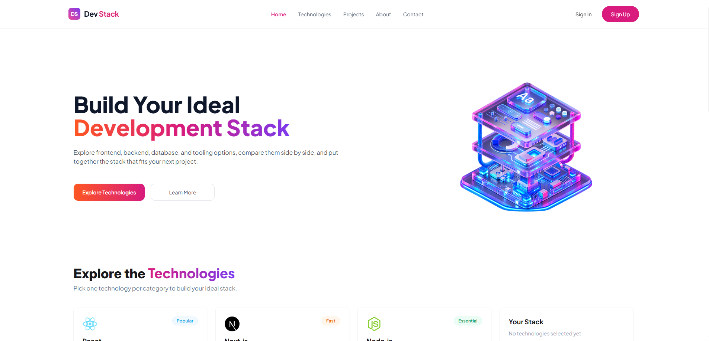

# DevStack

DevStack is a simple web app where developers can explore different technologies and create their own development stack.

## Technologies Used

* React
* TypeScript
* Vite
* Tailwind CSS
* DaisyUI
* React Toastify
* React Icons

## Features

* Browse different technologies with their details, rating, category, and difficulty.
* Add technologies to your own stack.
* Remove technologies individually or remove the whole stack at once.

## Preview



## Questions & Answers

### 1. What is JSX, and why is it used in React?

JSX is a way of writing HTML code inside JavaScript. It makes writing react UI easier and more readable.

### 2. What is the difference between props and state?

Props are used to pass data from a parent component to it's child components. State is used to store data inside a component that can change.

### 3. What does the useState hook do, and where did you use it in this project?

useState is used to store and update data in a component. In this project, I used it to keep track of the technologies added to the stack.

### 4. What does the useEffect hook do, and why did you need it to load the JSON data?

useEffect is used to run code lines or logic after a component renders. It is used to fetch data from an API when the page loads. I did not use useEffect in this project. I used use() hook to get the data.  

### 5. Why does every item in a .map() list need a unique key prop?

The key helps react identify each item in a list. It helps react update the list correctly when something changes.

### 6. What is conditional rendering? Show one place you used it.

Conditional rendering means showing different content based on a condition. I used it in the stack section. If the stack is empty, it shows an empty message. Otherwise, it shows the selected technologies.

```tsx
{stack.length === 0 ? (
  <p>Your Stack is empty.</p>
) : (
  <div>
      ...
  </div>
)}
```

### 7. How do you pass data from a parent component to a child component, and how does a child send something back to the parent?

A parent passes data to a child through props. To send something back, the parent can pass a function to the child, and the child can call that function.
